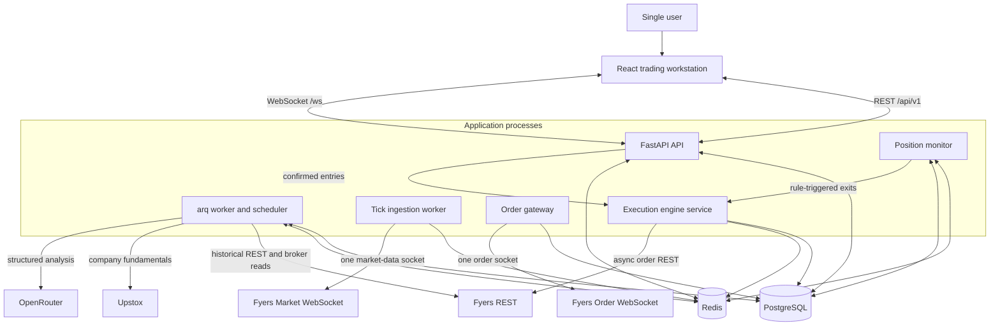
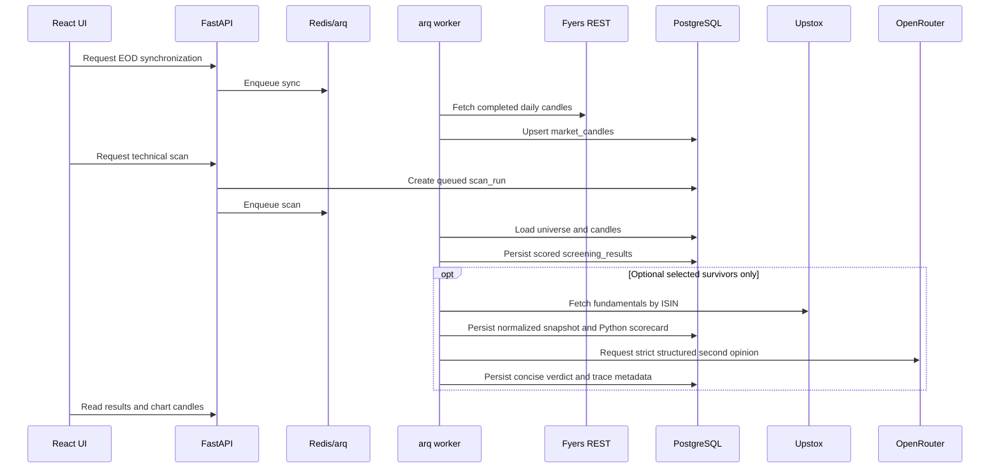
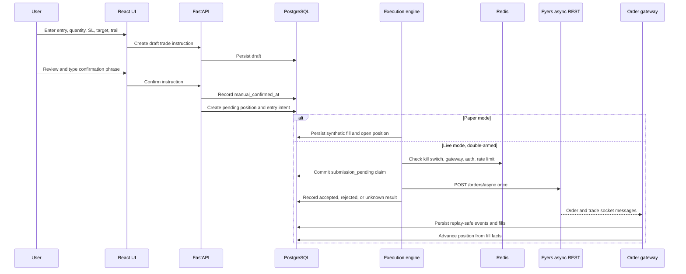
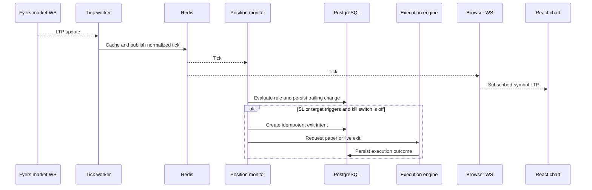

# SwingTraderVCP Architecture

This document describes the personal trading application implemented by
`client/` and `server/`. It explains the safety boundary, process topology,
component ownership, and the main data flows.

`AGENTS.md` is authoritative for locked architectural decisions.
`server/db/schema.sql` and the ordered files in `server/db/migrations/` are
authoritative for database structure.

## 1. Core invariant

SwingTraderVCP is a single-user, human-in-the-loop system:

```text
        AUTOMATED                         HUMAN                      AUTOMATED
[EOD data -> Screener -> AI] -> [Chart review -> Confirm trade] -> [Execute -> Monitor -> Exit]
        no money                     required checkpoint                  money
```

This boundary produces two non-negotiable rules:

1. Screening, fundamentals, and AI analysis never place or confirm an order.
2. After a human confirms a trade, position protection runs on the backend and
   does not depend on the browser.

The default product is CNC. Fyers owns price and broker truth. Upstox is
read-only and fundamentals-only. OpenRouter provides annotations and journal
analysis without access to trading tools.

## 2. System context



PostgreSQL is the durable system of record. Redis holds queue state,
coordination primitives, pub/sub messages, latest prices, and expiring worker
status. A Redis message is never a substitute for a persisted order event or
fill.

## 3. Process model

The system uses separate operating-system processes so a web-server restart or
closed browser does not intentionally disarm position management.

### 3.1 React client

Location: `client/src`

The client provides the scanner, charts, trade form, positions, order history,
tradebook, journal, and operations views. TanStack Query owns REST server state.
The browser WebSocket receives only subscribed symbols from the backend.

The client may compute display-only values, but it does not own screening
rules, stop/target calculations, authoritative position state, or broker
credentials. It never connects directly to Fyers.

### 3.2 FastAPI API

Entrypoint: `server/main.py`

The API owns request validation, thin CRUD endpoints, explicit human trade
instructions, system-control updates, and browser WebSocket sessions. It
creates Redis jobs for long-running work and uses a single Redis subscriber to
fan normalized ticks out to connected browsers.

The API does not open a Fyers market or order WebSocket. It reaches the
execution engine only after a validated manual confirmation.

### 3.3 arq worker and scheduler

Entrypoints: `server/run_worker.py` and `server/app/worker.py`

The arq process owns queued and scheduled work:

- incremental EOD candle synchronization;
- technical scanning;
- survivor-only fundamental collection and AI annotation;
- scheduled Fyers token refresh;
- broker reconciliation;
- journal fill processing;
- read-only journal AI analysis.

Jobs that can take seconds or minutes do not execute inline in normal API
requests.

### 3.4 Tick ingestion worker

Entrypoint: `python -m app.workers.tick_worker`

This process owns the only Fyers market-data WebSocket. Its subscription set is
the union of open positions, active watchlist symbols, open chart requests, and
the Nifty 50 benchmark used for market-regime context.

It normalizes incoming ticks, updates `ltp:{symbol}`, publishes to the Redis
`ticks` channel, and emits a heartbeat. It contains no order or position-rule
logic and does not persist every raw tick to PostgreSQL.

### 3.5 Position monitor

Entrypoint: `python -m app.workers.position_monitor`

The monitor reloads every non-closed position from PostgreSQL on startup and at
regular intervals. It subscribes to Redis ticks and control changes, evaluates
stop-loss, target, and supported step-percentage trailing rules, persists state
transitions, and requests idempotent exits through the execution engine.

The monitor never opens a broker socket. It must run in paper and live modes.
Its liveness, data freshness, and restart behavior are safety-critical because
the stops are software-held.

### 3.6 Order gateway

Entrypoint: `python -m app.workers.order_gateway`

The gateway owns the only Fyers order WebSocket and runs when live execution is
double-armed. It correlates asynchronous request IDs, broker order IDs,
exchange IDs, compact order tags, order events, and trades back to a durable
`order_intent`.

It persists replay-safe events and fills and advances position state from
broker facts. It never decides whether to trade.

### 3.7 Execution engine

Location: `server/app/services/execution_engine.py`

The execution engine is the only code allowed to place, modify, or cancel
Fyers orders. It is called by the API for a confirmed entry and by the position
monitor for a triggered exit.

Before live submission it enforces:

- paper/live mode and the independent live arming flag;
- the global kill switch;
- a fresh order-gateway heartbeat;
- a Redis-backed maximum of 10 operations per second;
- a unique idempotency key;
- committed intent state before the broker HTTP request;
- no blind retry after an ambiguous timeout or response.

## 4. Component ownership

| Component | Owns | Must not do |
| --- | --- | --- |
| React client | User interaction and presentation | Broker calls, trade decisions, screening/SL math |
| API routers | Validation, thin reads/writes, enqueueing, explicit confirmation | Screening loops, direct order REST, broker sockets |
| Screening jobs | `scan_runs`, `screening_results`, fundamental annotations | Confirm or place trades |
| Tick worker | Fyers market socket, Redis LTP cache and pub/sub | Position logic or orders |
| Execution engine | `order_intents`, all Fyers order REST mutations | Invent a trade without a confirmed instruction |
| Order gateway | Order WebSocket events and fills | Decide when to enter or exit |
| Position monitor | Position transitions and rule-triggered exit requests | Open broker sockets or bypass the execution engine |
| Reconciliation | Broker comparisons, discrepancy records, narrow matched-event healing | Place/cancel orders or fight unknown manual activity |
| Journal processor | Journal snapshots and fill-derived calculations | Change trading state |
| AI clients | Structured read-only annotation | Tools, order access, trade confirmation |

## 5. Research flow



The pipeline ends at review data. A scan result has no path to the execution
engine.

## 6. Trade and execution flow



Paper confirmation requires `CONFIRM_PAPER_TRADE`; live confirmation requires
`CONFIRM_LIVE_ORDER`. Live placement requires both `EXECUTION_MODE=live` and
`LIVE_ORDER_PLACEMENT_ENABLED=true`.

### Position monitoring and exit



Closing the browser only removes a presentation consumer. It does not stop
position monitoring.

## 7. Reconciliation and journal flow

Reconciliation runs on a schedule or by explicit operator request. It reads
Fyers orders, trades, positions, and holdings, then compares them with local
intents, fills, and positions.

It may replay a broker event through the existing gateway persistence path only
when that event matches an existing local intent. Unknown external activity and
quantity differences are written as discrepancies for human review. The job
never calls the execution engine.

Every persisted application-managed fill creates a journal outbox record in the
same database transaction. The journal processor uses those records to:

- freeze the first-entry chart, scanner, plan, and market-regime context;
- aggregate partial entries and exits;
- estimate CNC charges;
- calculate gross and net P&L and R-multiples;
- close the journal with the position;
- preserve editable notes, tags, lessons, rating, and actual charges.

The journal AI coach reads filtered closed trades. It receives deterministic
statistics and returns strict structured analysis without tools or money-path
access.

## 8. State machines

### Trade instruction

```text
draft -> confirmed -> submitted
  |          |
  +------> cancelled / rejected
```

`manual_confirmed_at` is required before entry execution. A manual trade may
omit a scanner reference but still uses the same instruction and audit path.

### Position

```text
pending_entry -> open -> trailing_active -> exit_pending -> closed
      |
      +------------------------------------------------> cancelled
```

Non-closed positions are reloaded after a monitor restart. Unsupported trailing
rules are logged and ignored rather than guessed.

### Order intent

```text
created -> submission_pending -> submitted -> acknowledged
                              -> partially_filled -> filled
                              -> rejected
                              -> submission_unknown
```

`submission_unknown` means the system cannot prove whether the broker accepted
the request. The request is not retried blindly; the order socket and
reconciliation resolve it when possible.

## 9. Data ownership

| Domain | Main tables | Primary writer |
| --- | --- | --- |
| Reference | `instruments`, `universe_memberships` | Instrument import |
| Market data | `market_candles`, optional `market_ticks` | Historical and ingestion services |
| Screening | `scan_runs`, `screening_results`, `fundamental_snapshots` | Screening and fundamental jobs |
| Review | `watchlists`, `watchlist_items` | Review API |
| Human checkpoint | `trade_instructions` | Trading API and service |
| Money path | `positions`, `position_events`, `order_intents`, `order_events`, `order_fills` | Execution engine, monitor, order gateway |
| Operations | `job_runs`, `reconciliation_runs`, `reconciliation_items`, `broker_auth_tokens`, `system_controls`, `system_events` | Scheduler and operational services |
| Journal | `market_regime_snapshots`, `journal_entries`, `journal_chart_artifacts`, `journal_fill_outbox`, `journal_ai_runs` | Journal processor and review API |

Important traceability chains:

```text
scan_runs -> screening_results -> trade_instructions -> positions

positions -> order_intents -> order_events / order_fills
                                |
                                +-> journal_fill_outbox -> journal_entries
```

Exact columns, constraints, partitions, and indexes belong in `server/db/`, not
in this architecture document.

## 10. Redis contracts

| Key or channel | Purpose |
| --- | --- |
| `ticks` | Normalized LTP pub/sub |
| `ltp:{symbol}` | Latest tick cache |
| `tick_subs` | Dynamic chart subscription requests |
| `system_controls` | Immediate kill-switch and control notifications |
| `auth:fyers:*` | Short-lived shared token and auth-health cache |
| `tick_worker:status` | Tick worker heartbeat |
| `tick_worker:symbols` | Current market-data subscription snapshot |
| `order_gateway:singleton` | Single live gateway lease |
| `order_gateway:status` | Gateway heartbeat used by the execution engine |
| `position_monitor:status` | Position-monitor heartbeat |
| arq keys | Queued jobs and job metadata |
| execution rate-limit keys | Distributed order-operation token bucket |

Redis pub/sub is at-most-once. Broker facts become authoritative only after
they are persisted to PostgreSQL by the owning component.

## 11. External provider boundaries

| Provider surface | Owner | Money side effect |
| --- | --- | --- |
| Fyers historical REST | Historical service | No |
| Fyers portfolio/order REST reads | Reconciliation | No |
| Fyers asynchronous order REST | Execution engine only | Yes |
| Fyers market WebSocket | Tick worker only | No |
| Fyers order WebSocket | Order gateway only | Records broker effects |
| Fyers OAuth callback | Auth router | Credential lifecycle only |
| Upstox fundamentals GET | Fundamental job only | No |
| OpenRouter inference | Fundamental and journal AI clients | No trading authority |

There are no provider event webhooks. Live prices arrive through the market
socket, broker order facts through the order socket, and missed broker state is
checked through REST reconciliation.

## 12. Safety controls and failure semantics

### Kill switch

The global kill switch is durable in `system_controls` and published through
Redis for immediate worker pickup.

When enabled:

- the execution engine refuses new automated place/modify operations;
- the monitor does not create new exit intents or trailing updates;
- existing broker positions remain open;
- the control does not flatten the account.

It means **no automated orders**, not **account is flat**.

### Failure behavior

| Failure | Expected response |
| --- | --- |
| Browser closes | Chart updates stop; position monitor continues |
| API restarts | Durable state remains; browser reconnects |
| Position monitor restarts | Reload non-closed positions and re-arm rules |
| Tick worker restarts | Reload required market-data subscriptions |
| Order gateway restarts | Reconnect socket; reconciliation covers missed facts |
| Fyers authorization fails | Emit an event and fail money-path operations closed |
| Broker HTTP result is ambiguous | Mark `submission_unknown`; do not blind-retry |
| Kill switch is enabled | Block new automated entries and exits; do not flatten |
| PostgreSQL is unavailable | Stop before placing orders that cannot first be recorded |
| Redis is unavailable | Live data, coordination, and jobs are impaired; PostgreSQL remains the ledger |
| Upstox or OpenRouter fails | Preserve technical review and the Fyers money path |

## 13. Deployment shape

The checked-in Compose file is for local PostgreSQL and Redis only. A persistent
deployment should independently supervise:

```text
FastAPI API
arq worker/scheduler
tick ingestion worker
position monitor
order gateway (live mode only)
React static application
PostgreSQL
Redis
```

Production operation additionally requires private data services, TLS, secret
management, database backups, log retention, stale-heartbeat alerts, and
restart drills with open paper positions. The application currently has no
end-user authentication and should remain on a trusted private interface until
an explicit access-control layer is designed.

## 14. Architecture change policy

Changes require explicit design review when they:

- bypass the human confirmation checkpoint;
- add another broker socket or order mutation path;
- move position enforcement into the browser or API process;
- let AI access confirmation or execution tools;
- add a market-data, order, or fundamentals provider;
- add a new long-running process or infrastructure dependency;
- change the CNC default, software exit model, or kill-switch semantics.

Update `AGENTS.md` first when a locked decision changes. Update this document
when process ownership or data flow changes, and update `server/db/` when the
schema changes.
