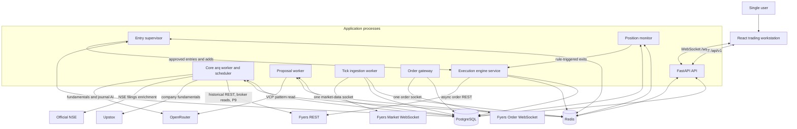
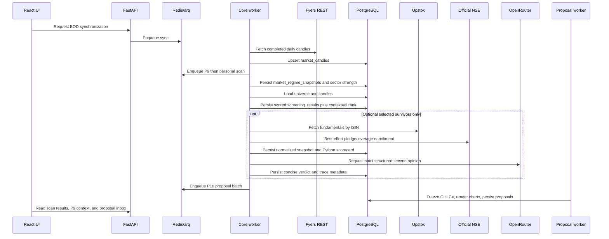
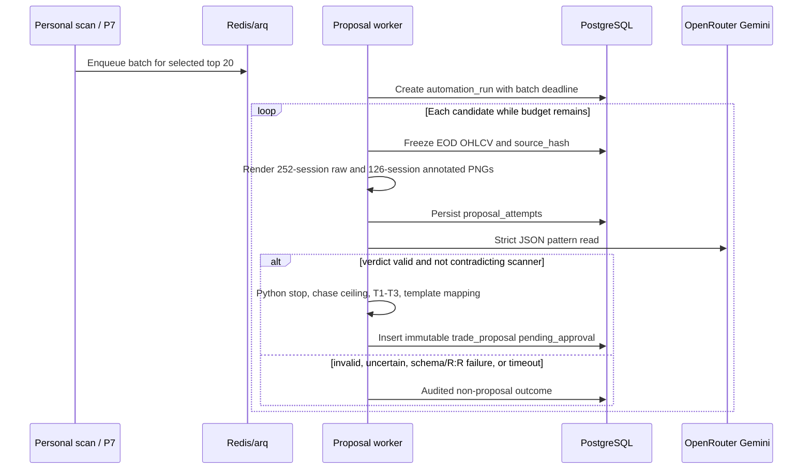
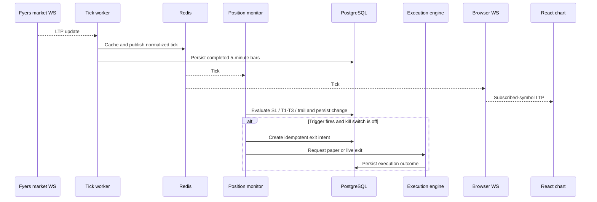

# SwingTraderVCP Architecture

This document describes the personal trading application implemented by
`client/` and `server/`. It explains the safety boundary, process topology,
component ownership, and the main data flows after P9 (deterministic market
context) and P10 (automated proposal generation and execution).

`AGENTS.md` is authoritative for locked architectural decisions.
`server/db/schema.sql` and the ordered files in `server/db/migrations/` are
authoritative for database structure.

The monorepo also contains Swyingify (`swyingify/`), a separate multi-user SaaS
with no money path. Shared Postgres, Redis/`arq`, and scan infrastructure may
serve both apps. This document covers the personal workstation only. SaaS scan
jobs must never consume P9 selection policy or invoke proposal approval,
entry supervision, execution, or the kill switch.

## 1. Core invariant

SwingTraderVCP is a single-user, human-in-the-loop swing system for Indian
equities via Fyers. Screening and trade-plan generation are automated. A human
approves or rejects an immutable proposal. Deterministic Python then owns
entry, sizing, stops, targets, trailing, and reconciliation.

```text
        AUTOMATED / NO MONEY                    HUMAN                 AUTOMATED MONEY PATH
[EOD -> P9 context -> scanner -> charts ->   [approve / reject]  ->  [entry supervisor
 Gemini pattern read -> Python proposal]      versioned plan          -> execute -> monitor -> exit]
                                              + risk budget           + reconcile + journal
```

This boundary produces four non-negotiable rules:

1. Screening, P9 market context, fundamentals, Gemini, and journal AI never
   place, size, confirm, or reject an order.
2. The human checkpoint is **approve or reject only**. Scanner-sourced live
   proposals cannot be edited in the browser. Approval accepts a versioned
   plan and a maximum monetary risk budget, not a stale quantity.
3. An HTTP request never places an entry inline. Approval arms the durable
   entry supervisor; the supervisor later submits through the execution engine.
4. After approval, position protection runs on the backend and does not depend
   on the browser.

The default product is CNC. Fyers owns price and broker truth. Upstox and
official NSE filings are read-only and fundamentals-only. OpenRouter provides
blind structured pattern reads, fundamental second opinions, and journal
analysis without trading tools. P9 is pure versioned Python with no model.

The free-form trade instruction form remains paper/log-only. It is not the
scanner-sourced live money path and is not retroactively converted into
proposals.

## 2. System context



PostgreSQL is the durable system of record. Redis holds queue state,
coordination primitives, pub/sub messages, latest prices, completed-bar
events, and expiring worker status. A Redis message is never a substitute for
a persisted order event, fill, trigger, or allocation decision.

## 3. Process model

The system uses separate operating-system processes so a web-server restart or
closed browser does not disarm proposal generation, entry supervision, or
position management. Proposal inference has its own concurrency-1 worker and
must not share the core worker's single execution slot.

### 3.1 React client

Location: `client/src`

The client provides operations, scanner, chart workspace, **trade-proposal
inbox**, fundamentals, positions, orders, tradebook, and journal. TanStack
Query owns REST server state. The browser WebSocket receives only subscribed
symbols from the backend.

The proposal inbox is the live human checkpoint: both frozen charts, scanner
rank, Gemini evidence, deterministic validation, pivot / T1–T3, stop and risk
rules, template, TTL, market-context light, and live leg / correction /
recovery state. The operator may approve, reject, or resolve an exact
capacity-conflict tie. The client does not offer quantity, stop, target, or
template edits for a scanner-sourced live proposal.

The client may compute display-only values. It does not own screening rules,
stop/target/sizing math, authoritative position state, or broker credentials.
It never connects directly to Fyers.

### 3.2 FastAPI API

Entrypoint: `server/main.py`

The API owns request validation, thin CRUD, proposal-run status, immutable
approve/reject with expected version/hash, capacity-conflict decisions,
versioned risk-policy and P9-policy reads/updates, system-control updates, and
browser WebSocket sessions. It creates Redis jobs for long-running work and
uses a single Redis subscriber to fan normalized ticks out to connected
browsers.

The API does not open a Fyers market or order WebSocket. It does not run the
proposal or entry loops. Approval records a decision and arms legs; it must
not call Fyers order APIs.

### 3.3 Core arq worker and scheduler

Entrypoints: `server/run_worker.py` and `server/app/worker.py`

The core arq process owns queued and scheduled work that is not proposal
inference:

- incremental EOD candle synchronization;
- deterministic P9 market-context computation;
- personal technical scanning (after P9);
- independent SaaS standard scan (does not consume P9 or the money path);
- survivor-only fundamental collection and AI annotation;
- scheduled Fyers token refresh / broker-auth readiness;
- broker reconciliation and 5-minute bar reconciliation;
- journal fill processing;
- read-only journal AI analysis;
- on-demand advisory VCP vision (screening/manual-review extension, not the
  P10 money-path proposal batch).

Personal EOD processing is ordered **EOD sync → P9 context → personal scan**.
The scan may then enqueue a P10 proposal batch onto the dedicated proposal
worker. Jobs that can take seconds or minutes do not execute inline in normal
API requests.

### 3.4 Proposal worker

Entrypoint: `python -m app.workers.proposal_worker`

A dedicated `arq` process with concurrency 1. For the scanner's selected top
20 it freezes EOD OHLCV, renders a raw 252-session context chart and a
deterministically annotated 126-session detail chart, calls Gemini serially
with a strict schema, and lets deterministic Python build or reject an
immutable proposal.

It has a 45-minute hard batch budget from shortlist freeze, a 90-second
per-attempt timeout, at most one retry when budget remains, and must not start
an attempt after the deadline. Remaining candidates become `timed_out`, not
silently deferred. Live-eligible output must exist by 08:30 Asia/Kolkata on
the next NSE session; later output is review-only and cannot be approved for
live entry. Pending-approval deadline is 09:00 Asia/Kolkata on that session.

The worker has no broker, account, or money-path context. Gemini never sees
funds, positions, or risk arithmetic. A `proposal_processing_paused` control
stops new inference without affecting open-position protection.

### 3.5 Tick ingestion worker

Entrypoint: `python -m app.workers.tick_worker`

This process owns the only Fyers market-data WebSocket. Its subscription set is
the union of open positions, **armed proposal symbols**, active watchlist
symbols, open chart requests, and the Nifty 50 benchmark used for journal
market-regime context.

It normalizes incoming ticks, updates `ltp:{symbol}`, publishes to the Redis
`ticks` channel, aggregates and persists completed 5-minute bars, publishes
`market:bars:5m` events, and emits a heartbeat. Periodic Fyers reconciliation
of those bars is data ingestion, not trade logic. The worker contains no
entry or position-rule logic and does not persist every raw tick to
PostgreSQL.

P9 index instruments are metadata-driven EOD subscriptions. They do not enter
the live market WebSocket set.

### 3.6 Entry supervisor

Entrypoint: `python -m app.workers.entry_supervisor`

Consumes completed, reconciled 5-minute bars for approved proposals. It owns
trigger evaluation, proposal expiry, add-leg Hold/Base/EMA21 gates, priority
and capacity ordering, fresh broker-state preflight, serialized deterministic
sizing under the Postgres allocation lock, P9 market/sector gates, and the
consecutive-stop circuit-breaker check.

It has no LLM and no Fyers socket. It persists trigger and allocation state
before calling the execution engine, reconstructs nonterminal legs on restart,
and never places an order itself. A `new_entries_paused` control (manual or
breaker-tripped) blocks new initial/add legs while the position monitor
continues protecting existing positions.

### 3.7 Position monitor

Entrypoint: `python -m app.workers.position_monitor`

The monitor reloads every non-closed position from PostgreSQL on startup and at
regular intervals. It subscribes to Redis ticks and control changes, evaluates
software stop-loss, staged T1/T2/T3, runner, and supported trailing rules
(including P10 `2×ATR14` high-water trail after T2), persists state
transitions, and requests idempotent exits through the execution engine.

The monitor never opens a broker socket. It must run in paper and live modes.
Its liveness, data freshness, and restart behavior are safety-critical because
the stops are software-held. P9 never asks it to exit, trim, or lower a stop.

### 3.8 Order gateway

Entrypoint: `python -m app.workers.order_gateway`

The gateway owns the only Fyers order WebSocket and runs when live execution is
double-armed. It correlates asynchronous request IDs, broker order IDs,
exchange IDs, compact order tags, order events, and trades back to a durable
`order_intent`.

It persists replay-safe events and fills and advances position state from
broker facts. It never decides whether to trade.

### 3.9 Execution engine

Location: `server/app/services/execution_engine.py`

The execution engine is the only code allowed to place, modify, or cancel
Fyers orders. It is called by the **entry supervisor** for approved
entries/adds/corrections and by the **position monitor** for triggered exits.

Before live submission it enforces:

- paper/live mode and the independent live arming flag;
- the global kill switch;
- a fresh order-gateway heartbeat;
- a Redis-backed maximum of 10 operations per second;
- a unique idempotency key;
- committed intent state before the broker HTTP request;
- no blind retry after an ambiguous timeout or response.

## 4. Component ownership

| Component | Owns | Must not do |
| --- | --- | --- |
| React client | Presentation, approve/reject, capacity-conflict choice | Broker calls, screening/SL/sizing math, proposal edits |
| API routers | Validation, thin reads/writes, enqueueing, immutable decisions | Screening loops, proposal/entry loops, direct order REST, broker sockets |
| Core arq jobs | EOD candles, P9 snapshots, scans, P7, reconcile, journal | Confirm proposals or place trades |
| Proposal worker | Frozen charts, vision attempts, immutable `trade_proposals` | Broker/account context, sizing, orders |
| Tick worker | Fyers market socket, Redis LTP, persisted 5m bars | Position logic or orders |
| Entry supervisor | Triggers, legs, allocation lock, P9/stop-streak gates at submit | LLM, Fyers sockets, inline HTTP placement |
| Execution engine | `order_intents`, all Fyers order REST mutations | Invent a trade without a supervisor/monitor request |
| Order gateway | Order WebSocket events and fills | Decide when to enter or exit |
| Position monitor | Position transitions and rule-triggered exit requests | Open broker sockets, bypass the execution engine, apply P9 management changes |
| Reconciliation | Broker comparisons, discrepancy records, narrow matched-event healing | Place/cancel orders or fight unknown manual activity |
| Journal processor | Journal snapshots and fill-derived calculations | Change trading state |
| P9 domain | Market light, sector strength, contextual selection order | Change `technical_score` / `result_rank`, manage open positions |
| AI clients | Structured read-only annotation | Tools, order access, trade confirmation, money arithmetic |

## 5. Research and context flow



P9 never changes `technical_score` or `result_rank`. It stores a green/yellow/red
market light, sixteen-sector strength versus Nifty 500, and a separate
contextual P7 selection order only inside inclusive two-point technical-score
bands. Shadow mode records the counterfactual. Enforced mode later multiplies
new-leg risk and can block lagging sectors.

Advisory on-demand VCP vision on the scanner sheet is a separate screening
extension. It does not create an approvable live proposal.

## 6. Proposal generation flow



Python is authoritative. Gemini may return verdict, geometry anchors, pivot,
T1–T3, confidence, and an `entry_template` enum. The schema contains no stop,
quantity, capital, risk, exposure, daily-loss, or trailing field. Provider
`reasoning_details` are neither persisted nor displayed.

Deterministic construction:

- Initial structural stop = final-contraction low minus `0.25×ATR14`, snapped
  to tick. Reject stop distance above 8%.
- Planned entry = pivot. Chase ceiling =
  `pivot + min(2% of pivot, 0.5 × (pivot - initial_stop))`.
- T1/T2/T3 must be at least 1R/2R/3R from the chase ceiling, strictly ordered,
  and tick-valid. Python never repairs an AI target.
- Template maps to maximum approved-risk shares, not raw notional:

| Template | Risk by leg | Required relative volume |
| --- | --- | --- |
| `single` | 100% | 2.0× |
| `three_leg_front` | 50% / 30% / 20% | 2.0× |
| `two_leg` | 60% / 40% | 1.75× |
| `three_leg_balanced` | 40% / 30% / 30% | 1.5× |

Reuse is allowed only when source, geometry, renderer, prompt, schema, model,
and risk-policy version hashes all match.

## 7. Approval, entry, and execution flow

```mermaid
sequenceDiagram
    participant U as User
    participant UI as Proposal inbox
    participant API as FastAPI
    participant DB as PostgreSQL
    participant ES as Entry supervisor
    participant EE as Execution engine
    participant R as Redis
    participant FY as Fyers async REST
    participant OG as Order gateway

    U->>UI: Review frozen charts and plan
    U->>UI: Approve or reject exact proposal hash
    UI->>API: POST decision with expected hash
    API->>DB: Record proposal_decision and arm D1 initial leg
    Note over API,EE: HTTP returns. No broker call.

    ES->>R: Completed 5-minute bar
    ES->>DB: Two-bar price and relative-volume confirmation
    ES->>DB: Fresh broker preflight (paper ledger or Fyers)
    ES->>DB: Acquire allocation lock and recompute all caps
    ES->>DB: Persist sizing and allocation event
    ES->>EE: Request entry or add
    EE->>R: Check kill switch, gateway, rate limit
    EE->>DB: Commit submission_pending claim
    alt Paper mode
        EE->>DB: Paper broker accepts and books the fill
        EE->>OG: Paper order/trade events
    else Live mode, double-armed
        EE->>FY: POST /orders/async once
        EE->>DB: Record accepted, rejected, or unknown result
        FY-->>OG: Order and trade socket messages
    end
    OG->>DB: Persist replay-safe events and fills
    OG->>DB: Advance position from fill facts
    ES->>DB: Post-fill risk recheck; tighten and/or trim
```

Approval before 09:00 Asia/Kolkata on D1 arms the initial leg for **D1 only**.
If it does not trigger that session it becomes `entry_expired`. A missed
deadline becomes `expired_unapproved` and can never be reactivated. A changed
plan requires a new immutable version and fresh approval. The active risk
policy may tighten or block an approved proposal at execution; it may never
enlarge it without reapproval.

Live placement still requires both `EXECUTION_MODE=live` and
`LIVE_ORDER_PLACEMENT_ENABLED=true`. P10 operational rollout is a durable
stage lock: Shadow (approve hard-blocked) → Paper (unified fill path, ₹1L
paper ledger) → reduced live (`0.25×` capital) → full live. No stage
promotes itself. Reduced live additionally requires an owner-approved P9
replay-report hash on an enforced market-context policy and empty paper books.

### 7.1 Intraday confirmation and adds

The entry supervisor never creates a market-data connection. It ignores the
first 15 minutes of the session. There is no price-only fallback.

Relative volume = current cumulative volume divided by
`(robust ADV20 × expected cumulative-volume fraction)`. Fewer than 15 valid
profile sessions, stale/missing cumulative volume, or unresolved
reconciliation drift blocks the trigger.

A signal bar must close above its pivot/base-high trigger with the template's
required relative volume. The next completed 5-minute bar must remain above
the trigger with relative volume still at or above the threshold. A trigger
that loses capacity is not held for a late entry.

Add eligibility begins only after the first fill and expires after 10 NSE
sessions. `single` has no adds. Hold and Base are sequential gates; every add
also requires `close > EMA21` and `EMA21 today > EMA21 five sessions ago`.
Python may ratchet the common stop up to base low minus `0.25×ATR14`; it may
never lower a stop. A stop trigger or the first T1 trigger permanently expires
every unfilled add leg.

### 7.2 Serialized capacity

Approval reserves neither cash nor shares. Immediately before every initial
entry, add, or correction the supervisor:

1. Fetches a fresh broker preflight. Paper reads the paper-broker ledger;
   live reads Fyers funds, positions, orders, and fills.
2. Acquires the Postgres allocation advisory lock.
3. Rejects broker snapshots older than 15 seconds or superseded local
   allocation generations.
4. Recomputes cash, per-trade and total open risk, position count, single-name,
   sector, `rho >= 0.80` correlation-cluster exposure, daily loss, the
   consecutive-stop breaker, current P9 gates, chase ceiling, and trigger
   validity.
5. Persists the sizing decision, then invokes the execution engine inside the
   locked workflow so the intent exists before any Fyers call.
6. Recomputes all constraints under the same lock from each actual fill.

When multiple valid signals compete, invalid/expired/cap-blocked candidates
are removed, remaining scores form descending two-point scanner bands, and
ties inside a band use Gemini confidence, conservative R:R, then trigger
timestamp. An exact remaining tie becomes `capacity_conflict`; the operator
selects one winner or skips all, without editing either proposal.

A leg is viable only at 50% or more of its approved leg-risk allocation and
when the resulting aggregate position contains at least four tradable shares
for staged exits. Rounding always floors toward less risk. Post-fill, a
residual no larger than one tradable lot may be persisted as
`rounding_residual` to prevent an order loop.

If actual entry VWAP exceeds the chase ceiling or invalidates approved minimum
R:R, one idempotent full `invalid_fill_exit` is sent. Otherwise the supervisor
first tries a structurally valid stop tighten, then a minimum whole-lot
`risk_reduction_exit`.

## 8. Position monitoring and exit



P10 staged exits:

- T1 exits 25%; after its fill, move the stop to weighted-average entry.
- T2 exits 25%; after its fill, activate a `2×ATR14` high-water trail.
- T3 exits 25%.
- The remaining 25% is the runner under the ATR trail.
- Stops and trails only ratchet upward. A stop exits all remaining quantity.
- A price gap that crosses multiple targets creates one cumulative exit, not
  duplicate target orders.
- Software stop, target, invalid-fill, and risk-reduction exits default to
  market/MPP. Limit exits remain opt-in.

Closing the browser only removes a presentation consumer. It does not stop
entry supervision or position monitoring. Unknown trailing-rule types log a
critical event and do not silently invent behavior.

## 9. Reconciliation and journal flow

Reconciliation runs on a schedule or by explicit operator request. It reads
Fyers orders, trades, positions, and holdings, then compares them with local
intents, fills, and positions.

It may replay a broker event through the existing gateway persistence path only
when that event matches an existing local intent. Unknown external activity and
quantity differences are written as discrepancies for human review. The job
never calls the execution engine. Manual trades placed in the Fyers app are
detected and flagged — never fought blindly.

Every persisted application-managed fill creates a journal outbox record in the
same database transaction. The journal processor uses those records to:

- freeze the first-entry chart, scanner, trade plan, and market-regime context;
- aggregate partial entries and exits;
- estimate CNC charges;
- calculate gross and net P&L and R-multiples;
- close the journal with the position;
- preserve editable notes, tags, lessons, rating, and actual charges.

The journal AI coach reads filtered closed trades. It receives deterministic
statistics and returns strict structured analysis without tools or money-path
access.

## 10. State machines

### Trade proposal

```text
pending_approval -> approved
                 -> rejected
                 -> expired_unapproved
```

The proposal payload is immutable after insert. Only `status` (and
`updated_at`) may change. `proposal_decisions` records exactly one
approve/reject with the expected hash.

### Entry leg

```text
planned -> armed -> trigger_observed -> intent_created -> submitted
                                              -> partially_filled -> filled
                                              -> expired / cancelled
                                              -> submission_unknown
```

`submission_unknown` means the system cannot prove whether the broker accepted
the request. The request is not retried blindly; the order socket and
reconciliation resolve it when possible.

### Position

```text
pending_entry -> open -> trailing_active -> exit_pending -> closed
      |
      +------------------------------------------------> cancelled
```

Non-closed positions are reloaded after a monitor restart. Unsupported trailing
rules are logged and ignored rather than guessed.

### Order intent

```text
created -> submission_pending -> submitted -> acknowledged
                              -> partially_filled -> filled
                              -> rejected
                              -> submission_unknown
```

### Manual trade instruction (paper/log-only)

```text
draft -> confirmed -> submitted
  |          |
  +------> cancelled / rejected
```

This path is retained for historical/paper logging. Scanner-sourced live
entries do not use it.

## 11. Data ownership

| Domain | Main tables | Primary writer |
| --- | --- | --- |
| Reference | `instruments`, `universe_memberships` | Instrument import |
| Market data | `market_candles`, optional `market_ticks`, `five_minute_bars`, `volume_profiles` | Historical and tick-ingestion services |
| Screening | `scan_runs`, `screening_results`, `fundamental_snapshots` | Screening and fundamental jobs |
| P9 context | `market_context_policies`, `market_regime_snapshots`, `sector_strength_runs`, `sector_strength_results` | Market-context job |
| Review | `watchlists`, `watchlist_items` | Review API |
| Advisory vision | `vcp_visual_analyses`, `vcp_visual_attempts` | On-demand VCP vision job |
| P10 proposals | `automation_runs`, `trade_proposals`, `proposal_attempts`, `proposal_decisions` | Proposal worker; decisions via API |
| P10 execution state | `entry_legs`, `trigger_events`, `capacity_conflicts`, `risk_policies`, `allocation_ledger` | Entry supervisor; policy via API |
| Risk circuit breaker | `risk_stop_streak_state`, `risk_stop_streak_events` | Stop-streak service / entry supervisor |
| Paper/log checkpoint | `trade_instructions` | Trading API (not the live scanner path) |
| Money path | `positions`, `position_events`, `order_intents`, `order_events`, `order_fills` | Execution engine, monitor, order gateway |
| Operations | `job_runs`, `reconciliation_runs`, `reconciliation_items`, `broker_auth_tokens`, `system_controls`, `system_events` | Scheduler and operational services |
| Journal | `journal_entries`, `journal_chart_artifacts`, `journal_fill_outbox`, `journal_ai_runs` | Journal processor and review API |

Important traceability chains:

```text
scan_runs -> screening_results -> automation_runs -> trade_proposals
                                                    -> proposal_decisions
                                                    -> entry_legs -> positions

positions -> approved proposal -> vision analysis -> screening_results -> scan_runs

positions -> order_intents -> order_events / order_fills
                                |
                                +-> journal_fill_outbox -> journal_entries
```

Exact columns, constraints, partitions, and indexes belong in `server/db/`, not
in this architecture document.

## 12. Redis contracts

| Key or channel | Purpose |
| --- | --- |
| `ticks` | Normalized LTP pub/sub |
| `ltp:{symbol}` | Latest tick cache |
| `tick_subs` | Dynamic chart subscription requests |
| `market:bars:5m` | Completed 5-minute bar events for the entry supervisor |
| `system_controls` | Immediate kill-switch and pause-control notifications |
| `auth:fyers:*` | Short-lived shared token and auth-health cache |
| `tick_worker:status` | Tick worker heartbeat |
| `tick_worker:symbols` | Current market-data subscription snapshot |
| `order_gateway:singleton` | Single live gateway lease |
| `order_gateway:status` | Gateway heartbeat used by the execution engine |
| `position_monitor:status` | Position-monitor heartbeat |
| `entry_supervisor:status` | Entry-supervisor heartbeat and armed-leg snapshot |
| arq keys | Queued jobs and job metadata, including the proposal-worker queue |
| execution rate-limit keys | Distributed order-operation token bucket |

Redis pub/sub is at-most-once. Broker facts, triggers, and allocation decisions
become authoritative only after they are persisted to PostgreSQL by the owning
component.

## 13. External provider boundaries

| Provider surface | Owner | Money side effect |
| --- | --- | --- |
| Fyers historical REST | Historical service | No |
| Fyers portfolio/order REST reads | Reconciliation and entry-supervisor preflight | No |
| Fyers asynchronous order REST | Execution engine only | Yes |
| Fyers market WebSocket | Tick worker only | No |
| Fyers order WebSocket | Order gateway only | Records broker effects |
| Fyers OAuth callback | Auth router | Credential lifecycle only |
| Upstox fundamentals GET | Fundamental job only | No |
| Official NSE filings | Fundamental job only | No |
| OpenRouter VCP / proposal vision | Proposal worker (money-path) and advisory VCP job | No trading authority |
| OpenRouter fundamentals / journal | Fundamental and journal AI clients | No trading authority |

There are no provider event webhooks. Live prices arrive through the market
socket, broker order facts through the order socket, and missed broker state is
checked through REST reconciliation.

## 14. Safety controls and failure semantics

### P9 market context and entry discipline

After the personal EOD candle sync, the core worker computes one immutable
`market_context_v1` snapshot before it queues the personal scan. Nifty 50,
Nifty 500, and Nifty Midcap 150 trend, point-in-time Nifty 500 breadth, and
constituent-turnover distribution are three independent axes. Two-of-three
evidence produces a green/yellow/red light stored separately from
`technical_score` and `result_rank`.

In enforced mode that light multiplies a new leg's deterministic risk ceiling
by `1.0 / 0.5 / 0.0`. Sixteen versioned sector contexts are ranked by excess
return versus Nifty 500. A sector confirmed lagging on two consecutive EOD
snapshots, or unavailable context, blocks that candidate's new initial/add.
The first non-lagging EOD releases the sector block, but any confirmation
observed while blocked is consumed and a fresh two-bar trigger is required.

Shadow mode records the counterfactual only. P9 starts in shadow and may
become enforced only through an immutable policy version with an
owner-approved replay-report hash. It cannot self-promote. Missing, stale,
incomplete, or hash-invalid context fails closed for new initials/adds only
after enforcement. No P9 condition changes an open position's stop, target,
trailing rule, or exit handling. Swyingify selection is unchanged.

### Consecutive-stop circuit breaker

The durable breaker is isolated by execution mode and begins at activation.
Only fully closed, P10 proposal-backed trades with exclusively `stop_loss`
fills and negative net P&L increment it. Normal target/trailing/mixed closures
reset an untripped streak. Manual, external, invalid-fill, and risk-correction
closures do not affect it.

A third qualifying closure atomically trips `new_entries_paused`. Monitoring,
exits, reconciliation, and journaling continue. It never auto-resumes: the
owner-reset API records an acknowledgement watermark and cannot clear an
independent manual pause.

### Kill switch and pause controls

The global kill switch is durable in `system_controls` and published through
Redis for immediate worker pickup.

When enabled:

- the execution engine refuses new automated place/modify operations;
- the monitor does not create new exit intents or trailing updates;
- existing broker positions remain open;
- the control does not flatten the account.

It means **no automated orders**, not **account is flat**.

P10 also requires separate **proposal-processing pause** and **new-entry
pause** controls. These may stop inference or new initial/add legs while the
position monitor continues protecting existing positions. They do not replace
or weaken the global kill switch.

### Failure behavior

| Failure | Expected response |
| --- | --- |
| Browser closes | Chart updates stop; entry supervisor and position monitor continue |
| API restarts | Durable state remains; browser reconnects; no inline orders were in flight from HTTP |
| Proposal worker restarts | Remaining batch candidates stay auditable; deadline still applies |
| Entry supervisor restarts | Reload nonterminal legs, triggers, and intents; no duplicate place |
| Position monitor restarts | Reload non-closed positions and re-arm rules |
| Tick worker restarts | Reload required market-data subscriptions; bar aggregator resumes |
| Order gateway restarts | Reconnect socket; reconciliation covers missed facts |
| Fyers authorization fails | Emit an event and fail money-path operations closed |
| Broker HTTP result is ambiguous | Mark `submission_unknown`; do not blind-retry |
| Kill switch is enabled | Block new automated entries and exits; do not flatten |
| PostgreSQL is unavailable | Stop before placing orders that cannot first be recorded |
| Redis is unavailable | Live data, coordination, and jobs are impaired; PostgreSQL remains the ledger |
| Upstox, NSE, or OpenRouter fails | Preserve technical review and the Fyers money path |
| P9 context is stale/incomplete/hash-invalid | Shadow: audit only; enforced: block new initials/adds |
| Sector is confirmed lagging/unavailable | Block only that candidate's new leg; preserve open-position management |
| Three-stop breaker trips | Pause new initials/adds until explicit owner reset |

On startup the money-path workers reload every nonterminal proposal, leg,
intent, event, fill, and position from Postgres. A persisted trigger without
an intent may create its original intent under the allocation lock. An
existing created/submitted/acknowledged/partial/unknown intent is never
recreated. Partial fills are managed from actual quantity and are never
blindly topped up.

## 15. Deployment shape

The checked-in Compose file is for local PostgreSQL and Redis only. A persistent
deployment independently supervises:

```text
FastAPI API
core arq worker/scheduler
proposal worker
tick ingestion worker
entry supervisor
position monitor
order gateway (paper event drain or live Fyers order WS)
React static application
PostgreSQL
Redis
```

Production operation additionally requires private data services, TLS, secret
management, database backups, log retention, stale-heartbeat alerts, and
restart drills with open paper positions. The personal application currently
has no end-user authentication and should remain on a trusted private
interface until an explicit access-control layer is designed.

Order-API deployment must use the registered static public IP required by
current Fyers retail-algo rules. Missing current-session auth or a
static-IP/readiness failure blocks new entry/add orders and emits a critical
event. Existing positions remain visible; any inability to enforce exits is a
money-path emergency, never hidden behind retries.

## 16. Architecture change policy

Changes require explicit design review when they:

- bypass the human approve/reject checkpoint or let HTTP place an entry;
- allow editing of a scanner-sourced live proposal;
- add another broker socket or order mutation path;
- move position enforcement or entry supervision into the browser or API process;
- let AI access confirmation, sizing, or execution tools;
- let P9 change open-position management or technical rank;
- add a market-data, order, or fundamentals provider;
- add a new long-running process or infrastructure dependency;
- change the CNC default, software exit model, kill-switch, or pause semantics;
- skip a P10 rollout gate or self-promote P9 from shadow to enforced.

Update `AGENTS.md` first when a locked decision changes. Update this document
when process ownership or data flow changes, and update `server/db/` when the
schema changes.
